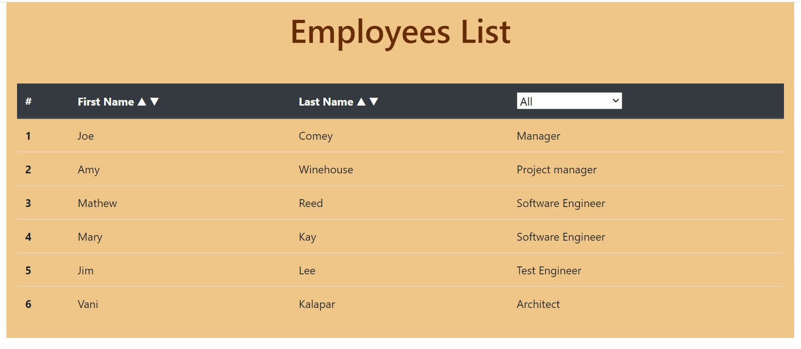
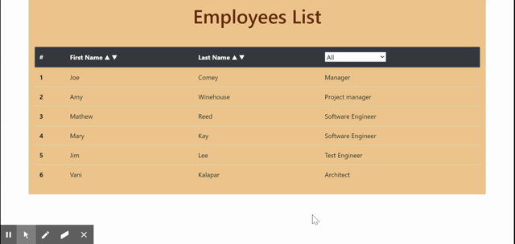

# react-employee-directory

## Description
Employee directory using React library for an enhanced user experience.

## Table of Contents
* [Installation](#installation)
* [Usage](#usage)
* [License](#license)
* [Contributing](#contributing)
* [Tests](#tests)
* [Questions](#questions)

## Installation
This application is located in GitHub at https://github.com/vkalaparthy/react-employee-directory.   The application is deployed [here](https://vkalaparthy.github.io/react-employee-directory/).

## Usage
Clone the repository https://github.com/vkalaparthy/workout-tracker and run "npm install" to get the node_modules for all the dependencies.  Run "npm start" and use the app. You can change the employees.json based on any data, for this app, I have just used a file. This application can:  
Sort the first name and last name in ascending or descending order  
Sort the rows based on id  
Show only one employee when clicked on the any part of employee row in the table 
Show Employees based on the selected Role (Selct a role based on the drop-down list)  

The application in loacalhost will look like this:  

  
  

Demo:  

 
  
Demo2:  
 

## License
Copyright © 2020-present, Vani Kalaparthy. Released under the MIT License.
## Contributing
## Tests

## Questions
* Vani Kalaparthy
  * https://github.com/vkalaparthy
  * kalaparthy.vani@gmail.com
